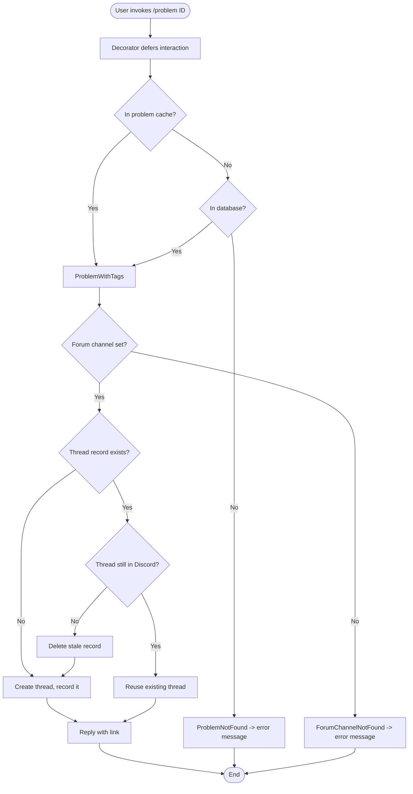
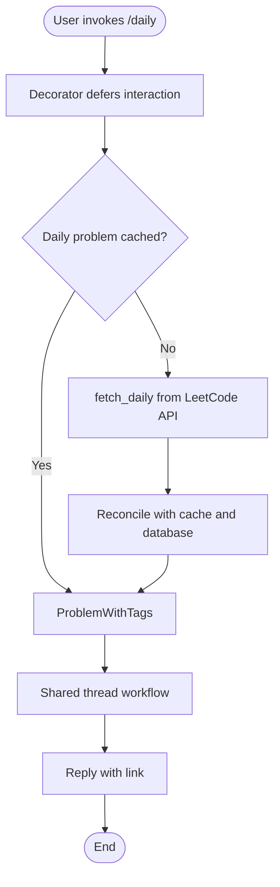
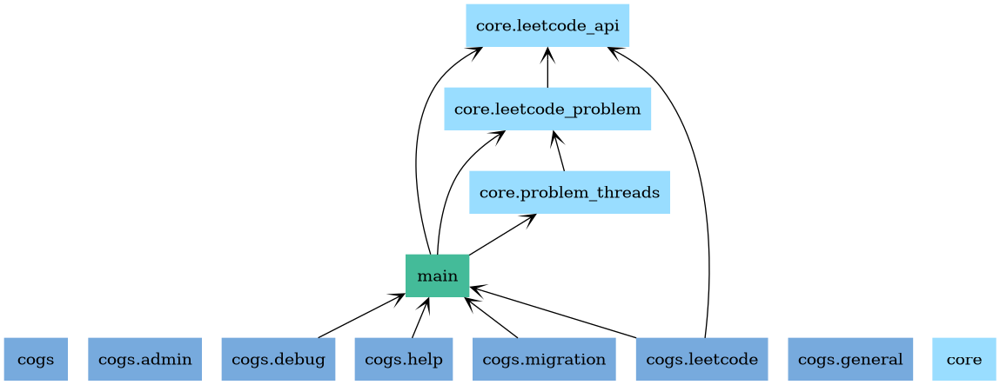
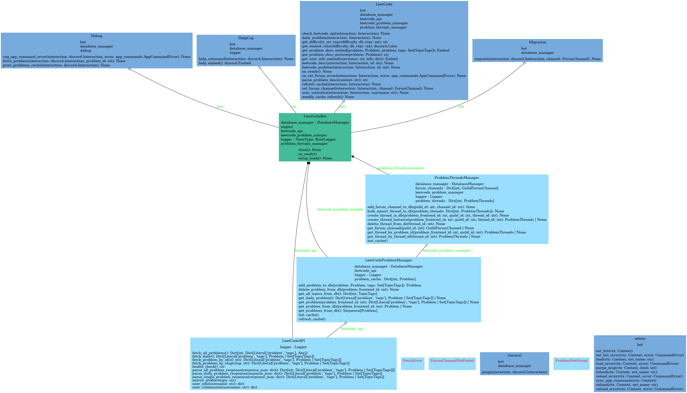

# Main Feature

<!--toc:start-->

- [Main Feature](#main-feature)
  - [LeetCode Commands](#leetcode-commands)
    - [The Shared Workflow](#the-shared-workflow)
    - [LeetCode Problem Thread Creation](#leetcode-problem-thread-creation)
    - [Daily Challenge Thread Creation](#daily-challenge-thread-creation)
    - [Where Problem Data Comes From](#where-problem-data-comes-from)
  - [UML charts](#uml-charts)
  <!--toc:end-->

## LeetCode Commands

For available commands, please refer to [README](https://github.com/xDDoubleTea/LeetCodeBot/blob/main/README.md).

### The Shared Workflow

The three commands that open a thread directly — `/problem`, `/daily` and `/random` — are wrapped in the `handle_leetcode_interaction` decorator from `utils/handle_leetcode_interation.py`. The decorated method's only job is to return a `ProblemWithTags`; the decorator does the rest:

1. Defers the interaction, since fetching can outrun Discord's three-second window.
2. Calls the command body to resolve the problem.
3. Replies and stops if nothing came back.
4. Hands the problem to `ProblemThreadsManager.reopen_or_create_problem_thread`.
5. Replies with a link, saying whether the thread was created or already existed.
6. Turns `ForumChannelNotFound`, `FetchError` and `ProblemNotFound` into readable messages.

This is why the individual commands are only a few lines each. `/problem-title` and `/filter-by-tag` do not use it: they return several candidates, so they answer with a paginated selection view from `view/pagination_view.py` instead.

### LeetCode Problem Thread Creation

**`/problem <id>`** opens a discussion thread for a problem by its LeetCode number.

Logic flow:

1. User invokes `/problem <id>`.
2. `LeetCodeProblemManager.get_problem_with_frontend_id` resolves it: the in-memory cache first, then the database. If it is in neither, it raises `ProblemNotFound` — the command does **not** reach out to LeetCode. See [Where Problem Data Comes From](#where-problem-data-comes-from).
3. `reopen_or_create_problem_thread` looks up the guild's configured forum channel, raising `ForumChannelNotFound` if `/set_forum_channel` was never run.
4. It checks the database for an existing thread for that problem in that guild.
5. If one exists and is still present in Discord, it is reused. If the record exists but the thread is gone, the record is deleted and a new thread is created.
6. `_create_thread` builds the thread: title `"<id>. <title>"`, the problem URL, the description embed, and the forum tags `LeetCode` plus the difficulty — creating those tags in the channel if they are missing.
7. The new thread is recorded in the database and the user gets a link.

Involved files:

- `cogs/leetcode.py` — `leetcode_problem`, the command definition.
- `utils/handle_leetcode_interation.py` — `handle_leetcode_interaction`, the shared workflow above.
- `core/leetcode_problem.py` — `get_problem_with_frontend_id`, `get_problem_from_db`.
- `core/problem_threads.py` — `reopen_or_create_problem_thread`, `get_forum_channel`, `get_thread_by_problem_id`, `_create_thread`, `create_thread_in_db`, `delete_thread_from_db`.
- `utils/embed_presenters.py` — `get_problem_desc_embed`.
- `utils/discord_utils.py` — `try_get_channel`.
- `db/problem.py`, `db/problem_threads.py`, `db/thread_channel.py` — the models.

### Daily Challenge Thread Creation

**`/daily`** does the same thing for today's LeetCode challenge. Only step 2 differs: the daily problem is not addressable by id, so it comes from the API.

1. `LeetCodeProblemManager.get_daily_problem` returns the cached daily problem if one is held.
2. Otherwise `fetch_daily_problem` calls `LeetCodeAPI.fetch_daily`, parsed by `_parse_daily_problem_response`.
3. The result is reconciled against the problem cache and the database, so the daily thread refers to the same `Problem` row as `/problem <id>` would.
4. From there the shared workflow takes over, identically.

Involved files, in addition to those above:

- `core/leetcode_api.py` — `fetch_daily`, `_parse_daily_problem_response`, `_validate_response`.
- `core/leetcode_problem.py` — `get_daily_problem`, `fetch_daily_problem`.
- `graphql/fetch_daily.graphql` — the query itself.

### Where Problem Data Comes From

The commands read from the cache and the database only. Nothing populates them on demand — that is `refresh_cache`'s job:

- A `tasks.loop` in `cogs/leetcode.py` runs it daily at `LEETCODE_API_REFRESH_TIME` (`config/constants.py`).
- `/refresh` runs it on request, admin only.

`refresh_cache` calls `LeetCodeAPI.fetch_all_problems`, upserts the results into the database, and rebuilds the in-memory cache. So a problem added to LeetCode since the last refresh will report as not found until the next one.

## UML charts

